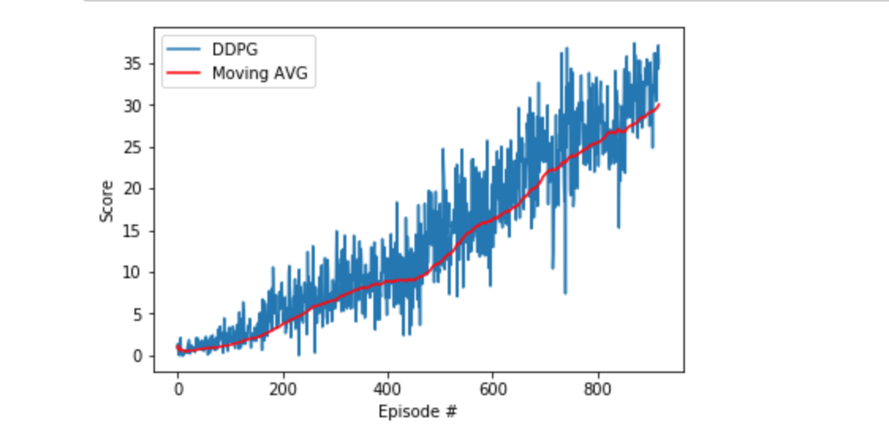

#Report

## Implimentation
I based my implementation off the code based of the DDPG implementation to an OpenAI Gym task to the OpenAI gym.

I adapted that code from the OpenAI gym environment to fit the the reacher environment where the agent was tasked with collecting yellow bananas vs blue bananas.

Two main pieces of code were used from the OpenAI gym in this project:
* ddgp_agent_2.py:
    * This file includes two classes
        * Agent - Which Interacts with and learns from the environment.
        *  OUNoise (Ornstein-Uhlenbeck process -  "to generate temporally correlated
exploration for exploration efficiency in physical control problems with inertia") - https://arxiv.org/pdf/1509.02971.pdf
        * ReplayBuffer(used in the Agent Class's init method) - A Fixed-size buffer to store experience tuples including:
            * state
            * action
            * reward
            * next_state
            * done

* model_2.py:
    * This includes a pytorch actor-critic architecture and learning algorithm, this network is what is used to determine which actions the agent will take to get more rewards.

* We then used a Jupter notebook to put everything together to train the agent in the environment. This is where we modified the code to work with the reacher environment. Here we modified where the action, next_state, reward, and done variables came from.

## Model architecture
The model architecture is the same used in the CONTINUOUS CONTROL WITH DEEP REINFORCEMENT
LEARNING [paper](https://arxiv.org/pdf/1509.02971.pdf)

The model is a pretty straight forward actor-critic which consists of a two nural networks each consisting of basic forward pass functions, relu activation and fully connected layers.

## Learning Algorithm
The learning Algorithm used was the DDDP which combined an actor-critic approach based on the DPG algorithm combined with a deep nueral network.

The parameters used were:
BUFFER_SIZE = int(1e6)  # replay buffer size
BATCH_SIZE = 128        # minibatch size
GAMMA = 0.99            # discount factor
TAU = 1e-3              # for soft update of target parameters
LR_ACTOR = 1e-3         # learning rate of the actor
LR_CRITIC = 1e-3        # learning rate of the critic
WEIGHT_DECAY = 0        # L2 weight decay

LEARN_EVERY = 20        # learning timestep interval
LEARN_NUM   = 10        # number of learning passes
GRAD_CLIPPING = 1.0     # Gradient Clipping

# Ornstein-Uhlenbeck noise parameters
OU_SIGMA  = 0.2
OU_THETA  = 0.15
#
EPSILON       = 1.0     # for epsilon in the noise process (act step)
EPSILON_DECAY = 1e-6

## Plot of Rewards
"Trained Agent"

## Ideas for Future Work
A couple of techniques that can be used to optimized our model that were discussed in the course are:

### Increasing the learning rate
I believe that increasing the learning rate would enable the model to train faster
